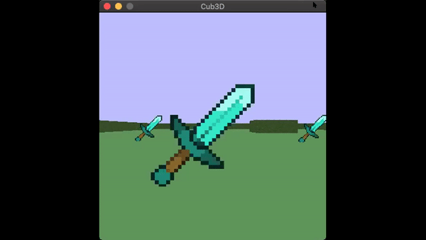

# Cub3D
> This project is inspired by the world famous [Wolfenstein](http://users.atw.hu/wolf3d/) 3D game, which
was the first FPS ever. The project enables to explore ray-casting and practical applications
of mathmatics. The goal is to code a first person game.

_note:_ graphics been implemented using minilibX library, which is
a graphics library similar to X11 that works on Mac systems. Also
i used the following projects:

- [Libft](https://github.com/FrenkenFlores/Libft): used functions that mimic libc functions;
- [Ft_printf](https://github.com/FrenkenFlores/Ft_printf): used to mange output;
- [Get_next_line](https://github.com/FrenkenFlores/Get_next_line): used to mange input.


## Configuration
The configuration file is located at `maps/` and has `*.map` extension. It contains
information about screen resolution, textures, colors and map. You can freely configure that file:
change map, color, textures (only `*.xpm` extensions are supported). You can also create your own configuration file. The program takes as an argument the configuration file.

### Example of configuration file

```
R 800 400
NO ./textures/book_shelf_nourth.xpm
SO ./textures/book_shelf_south.xpm
WE ./textures/book_shelf_west.xpm
EA ./textures/book_shelf_east.xpm
S ./textures/coin.xpm
F 0,38,77
C 190,190,211
    111111111111111111111
    100000000000000000001
    100002000000000200001
    100000000020000000001
    100000000000000000001
    10000000020W002000001
    100000000000000000001
    100020000000000200001
    100000000000000000001
    111111111111111111111

```
R - resolution<br/>
NO - north walls texture<br/>
SO - south walls texture<br/>
WE - west walls texture<br/>
EA - east walls textrue<br/>
S - sprite texture<br/>
F - floor color (R,G,B)
C - ceil color (R,G,B)

The map must be composed of only 6 possible characters: 0 for an empty space,
1 for a wall, and N,S,E or W for the player’s start position and spawning
orientation.

_note:_ for the map to be valid, it has be surrounded by walls.


## Build instructions
```bash
git clone https://github.com/FrenkenFlores/Cub3D
cd Cub3D
make
```
launch game

`./cub3D ./maps/map.cub`

take screenshot

`./cub3D ./maps/map.cub --save`


## Commands
A - turn left<br/>
D - turn right<br/>
W - move forward<br/>
S - move backward<br/>
ESC - close application<br/>

### Gameplay


---



